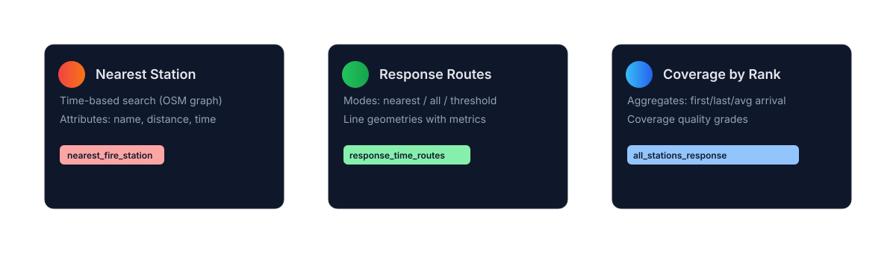
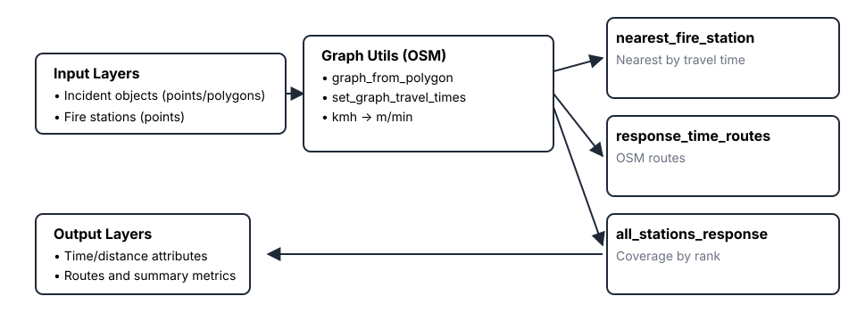
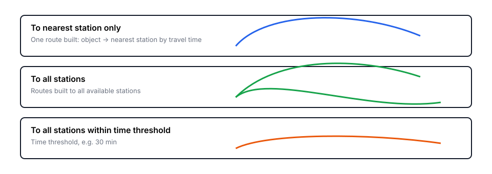
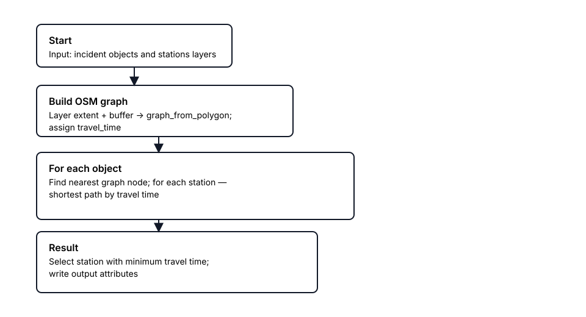
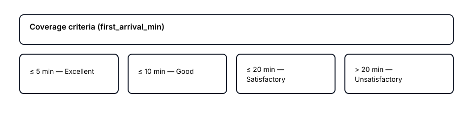

[](README.md)
## ARFFS Response Time Analysis (QGIS Plugin)

<p align="center">
  
</p>

<p align="center">
  <a href="https://github.com/Moroz-Froze/arrivel-time-calculator" target="_blank">
    
  </a>
  &nbsp;
  <a href="#использование">
    
  </a>
  &nbsp;
  <a href="https://github.com/Moroz-Froze/arrivel-time-calculator/issues" target="_blank">
    
  </a>
</p>

Плагин QGIS 3.x для анализа времени реагирования **Аварийно-спасательной и противопожарной службы аэродрома (ARFFS)** в соответствии с требованиями **ICAO Annex 14**. Включает физическое моделирование динамики транспортных средств (ускорение, торможение, ограничение скорости на поворотах), цветовую карту изохрон дорожной сети и настраиваемые профили типовых машин ARFFS.

<p align="center">
  
</p>

### Возможности

- **Изохроны времени реагирования ARFFS (`arffs_isochrone`)**:
  - Генерация цветовых полигонов дорожной сети, отображающих зоны времени реагирования от станций ARFFS.
  - **Зелёный**: < 2 минут (требование ICAO — первая машина).
  - **Оранжевый**: 2-3 минуты (требование ICAO — все машины).
  - **Красный**: > 3 минут (превышение норматива ICAO).
  - Разделение рёбер графа на границах временных порогов для точного определения зон.

- **Ближайшая пожарная станция (`nearest_fire_station`)**:
  - Определение ближайшей станции ARFFS по кратчайшему времени проезда с учётом физической модели.
  - Атрибуты: `nearest_station`, `distance_km`, `response_time_min`, `station_x`, `station_y` + исходные атрибуты объекта.

- **Маршруты времени реагирования (`response_time_routes`)**:
  - Построение маршрутов между объектами инцидентов и станциями ARFFS.
  - Режимы: только до ближайшей станции; до всех станций; до всех станций в пределах временного порога.
  - Атрибуты: `object_id`, `station_name`, `distance_km`, `response_time_min`, `object_type`, `route_type`.

- **Анализ реагирования всех станций (`all_stations_response`)**:
  - Одновременная оценка времени реагирования по всем рангам:
    - Ранг 1: 1 единица, Ранг 1-бис: 2 единицы, Ранг 2: 3 единицы, Ранг 3: 4 единицы, Ранг 4: 5 единиц, Ранг 5: 6 единиц.
  - Атрибуты по рангам: `rank_N_min`, `rank_N_max`, `rank_N_avg`.
  - Общая статистика: `arrival_time_min`, `arrival_time_max`, `arrival_time_mean`.
  - Оценка по ICAO (`evaluation`): "satisfactory" (первая единица <= 2 мин и среднее <= 3 мин), "marginal" или "unsatisfactory".

- **Матрица времени прибытия (`arrival_time_matrix`)**:
  - Расчёт времени прибытия от всех пожарных подразделений ко всем целевым объектам.
  - Результат: слой объектов со столбцами времени прибытия для каждого подразделения.

- **Первое прибывающее подразделение (`first_arrival_unit`)**:
  - Обработка матрицы прибытия для определения первого прибывающего подразделения.
  - Результат: `first_unit` (название станции) и `first_time` (минуты).

### Физическая модель времени проезда

Все алгоритмы используют **трапецеидальный профиль скорости**, моделирующий реалистичную динамику транспортного средства:

1. **Время активации** — настраиваемая задержка от сигнала тревоги до выезда (по умолчанию: 1.0 мин).
2. **Фаза разгона** — транспортное средство ускоряется от начальной скорости до крейсерской.
3. **Фаза крейсерского движения** — движение с максимальной скоростью дороги (ограниченной максимальной скоростью ТС).
4. **Фаза торможения** — снижение скорости для поворотов или остановки.

Углы поворота на перекрёстках вычисляются по геометрии дорог, применяются ограничения скорости на кривых:

| Угол отклонения | Коэффициент | Описание |
|---|---|---|
| 0-15° | 100% | Прямая дорога |
| 15-45° | 80% | Плавный поворот |
| 45-90° | 50% | Умеренный поворот |
| 90-135° | 30% | Крутой поворот |
| 135-180° | 15% | Разворот / почти остановка |

### Профили транспортных средств

| Транспортное средство | Макс. скорость (км/ч) | Ускорение (м/с²) | Торможение (м/с²) |
|---|---|---|---|
| Rosenbauer Panther 6x6 | 105 | 2.0 | 3.5 |
| Oshkosh Striker 3000 | 113 | 1.8 | 3.5 |
| Oshkosh Striker 6x6 | 113 | 1.6 | 3.0 |
| E-One Titan HPR | 100 | 1.7 | 3.2 |
| Пользовательский | Задаётся | Задаётся | Задаётся |

### Параметры транспортного средства

Все алгоритмы принимают следующие физические параметры:

| Параметр | Диапазон | По умолчанию | Описание |
|---|---|---|---|
| Время активации | 0-5 мин | 1.0 | Задержка тревога-выезд |
| Макс. скорость | 10-200 км/ч | 105 | Максимальная скорость ТС |
| Ускорение | 0.5-5.0 м/с² | 2.0 | Темп разгона |
| Торможение | 1.0-8.0 м/с² | 3.5 | Темп торможения |

<p align="center">
  
  <br/>
  <sub>Входные слои → Граф дорог → Физическая модель → Алгоритмы → Выходные слои</sub>
</p>

### Скорости по умолчанию для ARFFS (км/ч)

Эти скорости применяются при использовании пользовательских слоёв аэродромных дорог:

| Тип дороги | Скорость (км/ч) |
|---|---|
| ВПП (runway) | 80 |
| Периметровая дорога (perimeter road) | 70 |
| Рулёжная дорожка (taxiway) | 60 |
| Подъездная дорога (access road) | 50 |
| Служебная дорога (service) | 40 |
| Перрон (apron) | 30 |
| Прочее (other) | 30 |

При использовании дорожных сетей на основе OSM доступны также следующие скорости:

| Теги OSM `highway` | Скорость (км/ч) |
|---|---|
| trunk, motorway(+_link), primary(+_link) | 49 |
| secondary(+_link), unclassified | 37 |
| tertiary(+_link), residential, living_street | 26 |
| road, service, track | 16 |
| footway, path, pedestrian, steps, cycleway, bridleway, corridor | 5 |

### Требования
- QGIS: 3.16 - 3.99
- Доступ в интернет (для загрузки графа дорог OSM через OSMnx, если не используется собственный слой дорог)
- Python-зависимости в среде QGIS: `osmnx`, `networkx` (`shapely` обычно уже включён в QGIS)

### Установка зависимостей (Windows, OSGeo4W/QGIS)
1. Откройте **OSGeo4W Shell** (или **Консоль Python QGIS**).
2. Установите пакеты:

```bash
python -m pip install --upgrade pip
python -m pip install "osmnx>=1.4,<2.0" "networkx>=2.6,<3.0"
# При проблемах совместимости попробуйте фиксированные версии:
# python -m pip install osmnx==1.6.0 networkx==2.8.8
```

При работе через прокси-сервер добавьте флаги `--proxy` или настройте переменные окружения.

### Установка плагина
- Скопируйте папку плагина в каталог плагинов вашего профиля QGIS.
  Пример (Windows):
  - `C:\Users\<USER>\AppData\Roaming\QGIS\QGIS3\profiles\default\python\plugins\fire_analysis_plugin`
- Перезапустите QGIS и активируйте плагин через **Модули -> Управление и установка модулей**.

### Использование
1. Загрузите в проект:
   - **Слой станций ARFFS** (точки) — расположение пожарно-спасательных станций.
   - **Слой дорожной сети** (линии) — аэродромные дороги, рулёжные дорожки или сеть на базе OSM.
   - По необходимости **слой объектов/инцидентов** (точки или полигоны) для алгоритмов кроме изохрон.
2. Откройте **Панель инструментов обработки** -> группа **ARFFS Response Time Analysis**.
3. Запустите нужный алгоритм и настройте параметры:
   - Выберите **профиль транспортного средства** или задайте пользовательские физические параметры.
   - Установите **время активации** (задержка от тревоги до выезда).
   - Для маршрутов: выберите режим и, при необходимости, временной порог.
4. Выходные слои:
   - **Изохроны**: Полигональный слой с цветовыми зонами (зелёный/оранжевый/красный).
   - **Ближайшая станция**: Точечный/полигональный слой с атрибутами времени реагирования.
   - **Маршруты**: Линейный слой с геометрией маршрутов и атрибутами времени/расстояния.
   - **Анализ всех станций**: Слой с метриками по рангам и оценкой ICAO.
   - **Матрица прибытия**: Слой объектов со столбцами времени прибытия по подразделениям.
   - **Первое подразделение**: Слой с названием первого подразделения и временем прибытия.

<p align="center">
  
</p>

#### Режимы генерации маршрутов
<p>
  
</p>

### Критерии оценки ICAO Annex 14

Алгоритм «Анализ реагирования всех станций» оценивает покрытие по критериям ICAO Annex 14:

- **Satisfactory (удовлетворительно)**: Первая единица прибывает в течение 2 минут И среднее время <= 3 минут.
- **Marginal (допустимо)**: Первая единица прибывает в течение 3 минут, но критерии "satisfactory" не выполнены.
- **Unsatisfactory (неудовлетворительно)**: Время прибытия первой единицы превышает 3 минуты.

### Рекомендации и ограничения
- **Пользовательские слои дорог**: Для наилучших результатов на аэродромах используйте собственный слой дорожной сети с атрибутами типов дорог, а не данные OSM.
- **Полнота OSM**: При использовании сетей OSM точность маршрутов зависит от полноты данных OpenStreetMap в вашем регионе.
- **Загрузка графа**: Для больших территорий увеличивайте буфер с осторожностью — это влияет на размер графа и время вычислений.
- **CRS**: Алгоритмы автоматически обрабатывают преобразование координат, но входные слои должны иметь корректно определённую систему координат.
- **Двунаправленные дороги**: Рёбра аэродромных дорог по умолчанию считаются двунаправленными.

### Примеры результатов
- **Изохроны**: Цветовой полигональный слой с зонами зелёного (<2 мин), оранжевого (2-3 мин) и красного (>3 мин) цвета вокруг станций ARFFS.
- **Ближайшая станция**: Точечный/полигональный слой с атрибутами `nearest_station`, `response_time_min` и расстоянием.
- **Маршруты**: Линейный слой с геометрией маршрутов и временем реагирования по парам объект-станция.
- **Все станции по рангам**: Слой с атрибутами `rank_1_min/max/avg` по `rank_5_min/max/avg`, `arrival_time_min/max/mean` и `evaluation`.

<p>
  
</p>

#### Оценка покрытия
<p>
  
</p>

### Обратная связь и исходный код
- Репозиторий: [GitHub](https://github.com/Moroz-Froze/arrivel-time-calculator)
- Баг-репорты / запросы функций: [Issues](https://github.com/Moroz-Froze/arrivel-time-calculator/issues)

### История изменений
- **v2.0.0 — ARFFS Response Analysis**:
  - Добавлен алгоритм изохрон ARFFS с цветовой индикацией дорожных сегментов.
  - Добавлена физическая модель времени проезда (трапецеидальный профиль скорости).
  - Добавлено моделирование ускорения и торможения.
  - Добавлены ограничения скорости на поворотах.
  - Добавлен параметр времени активации (от тревоги до выезда).
  - Добавлены профили транспортных средств (Rosenbauer Panther 6x6, Oshkosh Striker 3000, Oshkosh Striker 6x6, E-One Titan HPR).
  - Добавлены типы дорог ARFFS (ВПП, рулёжная дорожка, перрон, периметровая дорога).
  - Добавлена поддержка двунаправленных рёбер для аэродромных дорог.
  - Обновлены пороги оценки в соответствии с ICAO Annex 14 (2 мин / 3 мин).
  - Все существующие алгоритмы обновлены с учётом физических параметров.
- **v1.1.0 — Fire Response 1.0**:
  - Добавлен алгоритм расчёта матрицы времени прибытия.
  - Добавлен алгоритм определения первого прибывающего подразделения.
  - Добавлены маршрутизация по OSM и анализ покрытия; 3 алгоритма, модуль графа OSM, автоматическое определение поля названия станции.

### Лицензия
См. файл `LICENSE` (если присутствует) или информацию о лицензии в метаданных плагина.
